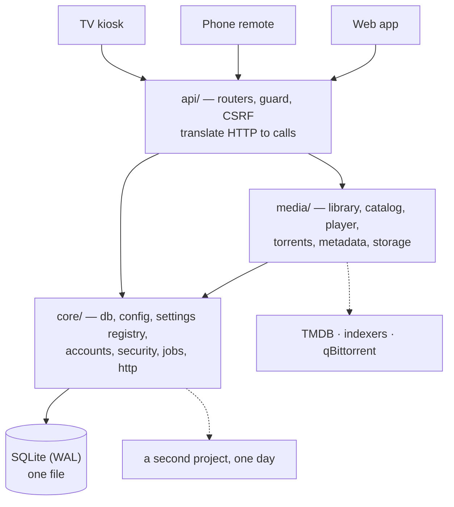

# Target architecture — proposed

Status: **proposed, not built.** Decisions are recorded in `docs/adr/`. Nothing here has been
implemented; the performance work already merged is described in `docs/ARCHITECTURE.md`.

## Requirements

### Functional

- One backend serves three interfaces (TV kiosk, phone remote, web app) plus a second, undefined project.
- A developer mode exposes what the box is doing and lets many values be tuned at runtime, hidden from an
  ordinary account.
- Everything the product needs is preinstalled: no post-install configuration step.

### Non-functional

| Property | Target | How it is known |
|---|---|---|
| Library page latency | < 20 ms at 3000 titles | `tools/bench.py`, p50 |
| Nothing blocks the event loop | no sync I/O in an `async def` | review + a test |
| Works offline | every feature except metadata lookup | already true |
| Core reusable | `core` imports nothing from `media` | enforced by a test |
| A bad setting cannot brick the box | values validated before storage | ADR-0002 |
| Restart is never required to tune | settings read through a cache | ADR-0002 |

### Constraints

- Debian appliance, installed by script, no operator, often offline.
- The second project is unknown — abstractions must not be invented for it (ADR-0001).
- 155 tests pass today and must keep passing at every step.

## Shape

The only rule that matters: **arrows never point from `core` into `media`.** A test asserts it.

## Decisions

| ADR | Decision | Trade-off accepted |
|---|---|---|
| [0001](adr/0001-split-core-from-media.md) | Split by the dependency direction that already exists; fix the two edges that contradict it | One disruptive rename now, against untangling later under deadline |
| [0002](adr/0002-typed-settings-registry.md) | Declare each setting once, typed; API, validation and UI follow | An indirection between a constant and its use |
| [0003](adr/0003-keep-sqlite.md) | Keep SQLite; invest in schema and measurement | One writer at a time |

## Risks

| Risk | Likelihood | Impact | Mitigation |
|---|---|---|---|
| The rename breaks an import path used by systemd, docs or the installer | High | Box fails to boot after update | Grep every `aura.` path outside Python too; run `install.sh` in a container before merging |
| Core is split wrong because the second project is unknown | Medium | Rework when it appears | ADR-0001: a folder, not a published package — moving a folder is cheap |
| A developer setting is tuned into a broken state | Medium | Box misbehaves with no obvious cause | Bounds enforced at write; turning developer mode off restores declared defaults |
| Settings read in a loop cost more than the constant did | Low | Slower than before optimising | Hoist reads out of loops; `tools/bench.py` before and after |
| The move quietly changes behaviour | Low | Silent regression | Any test needing more than an import-line edit is treated as evidence the move went too far |

## Failure modes

- **Metadata source down or rate-limited** — already handled: the search falls back to generated art and
  reports the failing source next to the results. The 429 from the keyless fallbacks is why enrichment is
  TMDB-only.
- **Drive unplugged mid-scan** — the scan transaction is per-drive and the availability filter is an
  `EXISTS` over mounted drives, so titles disappear from listings rather than producing dead rows.
- **qBittorrent not running** — the downloads page names the address in the error and backs off to one
  probe every 20 s instead of hammering it.
- **Database locked by a long scan** — writes are batched in one transaction per scan; the benchmark
  covers read latency, not yet read-during-write. Worth a measurement before claiming it is fine.

## Sequence

Each step ends with the full test suite green and a benchmark run, and is a commit of its own.

1. `core/settings.py` registry + schema endpoint, with the existing settings moved onto it. Visible
   value immediately, no file moves yet.
2. Developer mode: scope filtering, the panel rendered from the schema, and the diagnostics view.
3. Resolve the two leaks — `AppState` component registry, volume concept into core.
4. The folder move, plus the test that forbids `core` importing `media`.
5. `/api/home`: 12 serial calls in a sync handler, cached and parallel.
